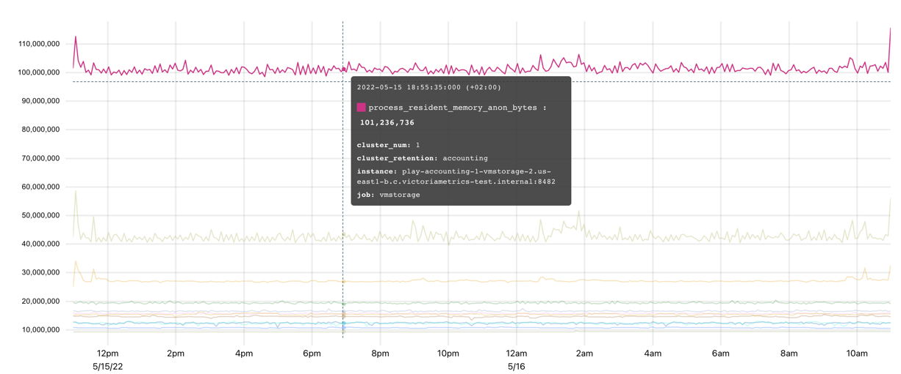

# 核心概念


核心概念在定义处会给出对应的中文词汇定义，但在文档的其他地方，引用这些概念时还是保留英文。因为使用中文更容易带来理解负担。

就像我们经常使用 CPU 这个英文词汇，而不会使用中央处理器这个词一样。


## 数据模型

### 什么是 Metric（度量指标）

简单来说，`metric`是对某物的数值测量或观察。

度量标准最常见的用途包括：

* 检查系统在特定时间段内的行为；
* 将行为变化与其他测量结果相关联；
* 观察或预测趋势；
* 如果度量标准超过阈值，则触发事件（警报）。

### Metric 的结构

让我们从一个例子开始。为了追踪我们的应用程序提供了多少请求，我们将定义一个名为`requests_total`的指标。

在这里你可以更具体一些，比如说`requests_success_total`（仅针对成功的请求）或者`request_errors_total`（针对失败的请求）。选择一个指标名称非常重要，它应该能够清楚地向每个阅读它的人解释实际测量到了什么内容，就像编程中的变量名一样。

#### Labels（标签）

每个指标都可以包含额外的元信息，以 Label 对的形式呈现：

```promql
requests_total{path="/", code="200"} 
requests_total{path="/", code="403"} 
```

元信息 - 一组用花括号括起来的 Labels - 为我们提供了`request`被处理的`path`和`status code`的上下文。Label 的值始终是`string`类型。VictoriaMetrics数据模型是无模式的（No Scheme），这意味着不需要预先定义指标名称或其标签。用户可以随时添加或更改已采用的指标。

实际上，指标名称也是一个具有特殊名称`__name__`的 Label。因此，以下两个系列是相同的：

```promql
requests_total{path="/", code="200"} 
{__name__="requests_total", path="/", code="200"} 
```

Labels可以自动附加到通过vmagent或Prometheus编写的时间序列上。VictoriaMetrics支持对查询API强制执行 Label 过滤器以模拟数据隔离。然而，真正的数据隔离可以通过多租户实现。

#### **Time series（时间序列）**

一个指标名称和其Label的组合定义了一个时间序列。例如，`requests_total{path="/", code="200"}` 和 `requests_total{path="/", code="403"}` 是两个不同的时间序列，因为它们在`code`标签上有不同的值。

唯一时间序列的数量对数据库资源使用有影响。详细信息请参阅[什么是活跃时间序列](faq.md#what-is-an-active-time-series)以及[什么是高流失率](faq.md#gao-diu-shi-lv-shi-zhi-shen-me)。

**Cardinality（基数）**

唯一时间序列的数量被称为基数。过多的唯一时间序列被称为高基数。高基数可能导致在VictoriaMetrics中增加资源使用量。请参阅[这篇文档](faq.md#shen-me-shi-gao-ji-shu)以获取更多详细信息。

#### Raw samples（原始样本）

每个唯一的时间序列可以由任意数量的`（value，timestamp）`数据点（也称为`原始样本`）组成，它们按照`timestamp`排序。`value`是[双精度浮点数](https://en.wikipedia.org/wiki/Double-precision\_floating-point\_format)。`timestamp`是具有毫秒精度的[Unix时间戳](https://en.wikipedia.org/wiki/Unix\_time)。

以下是一个 [Prometheus 文本格式](https://github.com/prometheus/docs/blob/main/content/docs/instrumenting/exposition\_formats.md#text-based-format) 的单个原始样本的示例：

```promql
requests_total{path="/", code="200"} 123 4567890
```

* `requests_total{path="/", code="200"}` 用于标识给定样本的相关时间序列。&#x20;
* `123` 是一个样本值。&#x20;
* `4567890` 是可选的样本时间戳。如果缺失，则在将样本存储到VictoriaMetrics中时使用当前时间戳。

**Time series resolution（时间序列分辨率）**

分辨率是 [timeseries](he-xin-gai-nian.md#time-series-shi-jian-xu-lie) 的 [samples](he-xin-gai-nian.md#raw-samples-yuan-shi-yang-ben) 之间的最小间隔。考虑以下示例：

```
----------------------------------------------------------------------
|              <time series>                 | <value> | <timestamp> |
| requests_total{path="/health", code="200"} |    1    |  1676297640 |
| requests_total{path="/health", code="200"} |    2    |  1676297670 |
| requests_total{path="/health", code="200"} |    3    |  1676297700 |
| requests_total{path="/health", code="200"} |    4    |  1676297730 |
....
```

这里有一个时间序列请求总数`{path="/health", code="200"}`，每30秒更新一次值。这意味着它的分辨率也是30秒。

在拉取模式中，分辨率等于抓取间隔，并由监控系统（服务器）控制。对于推送模式，分辨率是样本时间戳之间的间隔，并由客户端（指标收集器）控制。

尽量保持时间序列的分辨率一致，因为某些[MetricsQL](metricql.md)函数可能期望如此。

### Metric 类型 <a href="#types-of-metrics" id="types-of-metrics"></a>

在 VictoriaMetrics 内部，并 metric type 的概念。此概念存在是为了帮助用户理解度量是如何测量的。有四种常见的度量类型。

#### Counter（计数器）

`Counter` 是一种用于统计某些事件的发生次数的 Metric。它的值是累加的，随着时间增加或保持不变，在一般情况下不会减少。唯一的例外是当计数器重置为零时，例如`计数器重置`。当暴露 Counter 指标的服务重新启动时，可能会发生`计数器重置`。因此，`Counter`指标显示了自服务启动以来观察到的事件数量。

在编程中，Counter 是一个变量，在每次发生某个事件时递增其值。

<figure><figcaption></figcaption></figure>

`vm_http_requests_total` 是一个典型的 Counter 示例。上面图表的解释是，时间序列 `vm_http_requests_total{instance="localhost:8428", job="victoriametrics", path="api/v1/query_range"}` 在下午1点38分到1点39分之间迅速变化，然后在1点41分之前没有任何变化。

Counter 用于测量事件数量，例如请求、错误、日志、消息等。与计数器一起使用最常见的 [MetricsQL](metricql.md) 函数有：

* `rate` - 计算指标每秒平均变化速度。例如，`rate(requests_total)` 显示平均每秒服务多少个请求；
* `increase` - 计算给定时间段内指标的增长情况，时间段由方括号中指定。例如，`increase(requests_total[1h])` 显示过去一小时内服务的请求数量。

Counter 可以具有小数值。例如，`request_duration_seconds_sum` 计数器可能会对所有请求的持续时间进行求和。每个持续时间可能以秒为单位具有小数值，如`0.5` 秒。因此所有请求持续时间的累积总和也可能是小数。

建议在 `Counter` 指标名称中添加 `_total`、`_sum` 或 `_count` 后缀，这样人们就可以轻松区分这些指标与其他类型的指标。

#### **Gauge（仪表）**

Gauge 用于测量可以上下变化的值：

<figure><figcaption></figcaption></figure>

图表上的度量指标 `process_resident_memory_anon_bytes` 显示了应用程序在每个给定时间点的内存使用情况。它经常变化，上下波动，显示进程如何分配和释放内存。在编程中，`gauge` 是一个变量，你可以将其设置为随着变化而改变的特定值。

以下是 `gauge` 的使用场景：

* 测量温度、内存使用情况、磁盘使用情况等；
* 存储某个过程的状态。例如，如果配置重新加载成功，则可以将 gauge `config_reloaded_successful` 设置为 `1`；如果配置重新加载失败，则设置为 `0`；
* 存储事件发生时的时间戳。例如，`config_last_reload_success_timestamp_seconds` 可以存储最后一次成功配置重新加载的时间戳。

与 gauges 最常用的 [MetricsQL](metricql.md) 函数是聚合函数和滚动函数。

#### **Histogram（直方图）**

Histogram 是一组具有不同`vmrange`或`le`标签的 Counter 指标。 `vmrange`或`le`标签定义了特定`bucket`（桶）的测量边界。当观察到的测量值命中特定的`bucket`时，相应的Counter会递增。

直方图桶通常在其名称中带有`_bucket`后缀。例如，VictoriaMetrics使用`vm_rows_read_per_query`直方图跟踪每个查询处理的行分布情况。该 Histogram 的暴露格式如下：

```promql
vm_rows_read_per_query_bucket{vmrange="4.084e+02...4.642e+02"} 2
vm_rows_read_per_query_bucket{vmrange="5.275e+02...5.995e+02"} 1
vm_rows_read_per_query_bucket{vmrange="8.799e+02...1.000e+03"} 1
vm_rows_read_per_query_bucket{vmrange="1.468e+03...1.668e+03"} 3
vm_rows_read_per_query_bucket{vmrange="1.896e+03...2.154e+03"} 4
vm_rows_read_per_query_sum 15582
vm_rows_read_per_query_count 11
```

其中 `vm_rows_read_per_query_bucket{vmrange="4.084e+02...4.642e+02"} 2` 这一行表示自上次VictoriaMetrics启动以来，vmrange的值在`(408.4 - 464.2]`区间的查询有2个。

以 `_bucket` 后缀结尾的计数器可以使用 `histogram_quantile` 函数估算观测测量值的任意百分位数。例如，以下查询返回在过去一小时内每个查询读取的行数的估算第99百分位数（见方括号中的 1h）：

```promql
histogram_quantile(0.99, sum(increase(vm_rows_read_per_query_bucket[1h])) by (vmrange))
```

这个查询的执行逻辑如下：

* 增加`(vm_rows_read_per_query_bucket[1h])` 计算每个桶每个实例在过去一小时内的事件数量。
* `sum(...)` 按 `(vmrange)` 计算相同 `vmrange` 值的每个实例桶的事件总数。
* `histogram_quantile(0.99, ...)` 在步骤 2 返回的 `vmrange` 桶上计算第 99 百分位数。

histogram 类型还暴露了额外两个附加计数器，以 `_sum` 和 `_count` 后缀结尾。

`vm_rows_read_per_query_sum`是所有观测到的测量值的总和，例如自上次VictoriaMetrics启动以来由所有查询服务的行数之和。

`vm_rows_read_per_query_count`是观测到的事件总数，例如自上次VictoriaMetrics启动以来观测到的查询总数。

这些计数器允许在特定回溯窗口内计算平均测量值。例如，以下查询计算最近5分钟（方括号中为5m）每个查询读取行数的平均值：

```promql
increase(vm_rows_read_per_query_sum[5m]) / increase(vm_rows_read_per_query_count[5m])
```

使用[github.com/VictoriaMetrics/metrics](https://github.com/VictoriaMetrics/metrics)包，可以通过以下方式在Go应用程序中使用`vm_rows_read_per_query`直方图：

```go
// define the histogram
rowsReadPerQuery := metrics.NewHistogram(`vm_rows_read_per_query`)

// use the histogram during processing
for _, query := range queries {
    rowsReadPerQuery.Update(float64(len(query.Rows)))
}
```

我们来看看每次调用`rowsReadPerQuery.Update`时，会发生什么：

* 计数器`vm_rows_read_per_query_sum`的值将增加`query.Rows`表达式的长度；
* 计数器`vm_rows_read_per_query_count`增加`1`；
* 只有在观察到的值在`vmrange`定义的范围（桶）内时，计数器`vm_rows_read_per_query_bucket`才会递增。

这样一组计数器指标可以在[Grafana中绘制热力图](https://grafana.com/docs/grafana/latest/visualizations/heatmap/)并计算[分位数](https://prometheus.io/docs/practices/histograms/#quantiles)：

<figure><figcaption></figcaption></figure>

Grafana对带有vmrange标签的桶不理解，因此在构建Grafana中的热力图之前，必须使用[prometheus\_buckets](metricql.md)函数将带有`vmrange`标签的桶转换为带有`le`标签的桶。

histogram 通常用于测量延迟分布、元素大小（例如批处理大小）等。VictoriaMetrics支持两种直方图实现：

* Prometheus Histogram。[大多数客户端库](https://prometheus.io/docs/instrumenting/clientlibs/)都支持这种经典的 Histogram 实现方式。Prometheus Histogram 要求用户静态定义范围（bucket）。
* VictoriaMetrics Histogram 由[VictoriaMetrics/metrics](https://github.com/VictoriaMetrics/metrics)工具库支持。Victoriametrics Histogram 会自动处理桶边界，因此用户无需考虑它们。

我们建议您在开始使用直方图之前阅读以下文章：

1. [Prometheus histogram](https://prometheus.io/docs/concepts/metric\_types/#histogram)
2. [Histograms and summaries](https://prometheus.io/docs/practices/histograms/)
3. [How does a Prometheus Histogram work?](https://www.robustperception.io/how-does-a-prometheus-histogram-work)
4. [Improving histogram usability for Prometheus and Grafana](https://valyala.medium.com/improving-histogram-usability-for-prometheus-and-grafana-bc7e5df0e350)

#### **Summary（摘要）**

Summary 与 Histogram 非常相似，用于计算[分位数](https://prometheus.io/docs/practices/histograms/#quantiles)。主要区别在于 Summary 是在客户端进行计算的，因此指标公开格式已经包含了预定义的分位数：

```
go_gc_duration_seconds{quantile="0"} 0
go_gc_duration_seconds{quantile="0.25"} 0
go_gc_duration_seconds{quantile="0.5"} 0
go_gc_duration_seconds{quantile="0.75"} 8.0696e-05
go_gc_duration_seconds{quantile="1"} 0.001222168
go_gc_duration_seconds_sum 0.015077078
go_gc_duration_seconds_count 83
```

Summary 的可视化非常直观：

<figure><figcaption></figcaption></figure>

这种方法使得 Summary 更易于使用，但与 Histogram 相比也存在显著的限制：

* 无法计算多个 Summary 指标的分位数，例如 `sum(go_gc_duration_seconds{quantile="0.75"})`、`avg(go_gc_duration_seconds{quantile="0.75"})` 或 `max(go_gc_duration_seconds{quantile="0.75"})` 不会返回从应用程序的多个实例收集到的 `go_gc_duration_seconds` 指标的预期第75百分位数。有关详细信息，请[参阅本文](https://latencytipoftheday.blogspot.de/2014/06/latencytipoftheday-you-cant-average.html)。
* 无法计算除已经预先计算过的分位数之外的其他分位数。
* 无法针对在任意时间范围内收集到的测量值计算分位数。通常，Summary 分位数是在固定时间范围内（如最近5分钟）计算出来的。

Summary 通常用于跟踪延迟、元素大小（例如批处理大小）等预定义百分比。

### 使用 Metric 对应用进行观测

正如在[Metric类型](he-xin-gai-nian.md#types-of-metrics)部分的开头所说，Metric类型定义了它是如何被测量的。VictoriaMetrics TSDB并不知道Metric类型。它只看到Metric的名称、Label、Value和 Timestamp。这些 Metric 是什么，它们衡量什么以及如何衡量 - 这一切都取决于发出这些指标的应用程序。

为了使用与VictoriaMetrics兼容的Metric来监控您的应用程序，我们建议使用[github.com/VictoriaMetrics/metrics](https://github.com/VictoriaMetrics/metrics)包。

VictoriaMetrics还与[Prometheus客户端库兼容](https://prometheus.io/docs/instrumenting/clientlibs/)。

#### 命名

我们建议遵循[Prometheus的指标命名规范](https://prometheus.io/docs/practices/naming/)。对于VictoriaMetrics来说，没有严格的限制，所以任何指标名称和标签都是可以接受的。但是遵循这个约定有助于保持名称有意义、描述性强，并且清晰易懂给其他人。遵循这个约定是一个好习惯。

#### Label

每个测量值都可以包含任意数量的`key="value"`标签。良好的实践是保持这个数量有限。否则，处理包含大量标签的测量将会很困难。默认情况下，VictoriaMetrics将每个测量值的标签数限制为`30`，并丢弃其他标签。如果需要，可以通过`-maxLabelsPerTimeseries`命令行参数来更改此限制（但不建议这样做）。

每个标签值都可以包含任意字符串值。良好的实践是使用简短而有意义的标签值来描述指标属性，而不是讲述它们的故事。例如，label-value对environment="prod"是可以接受的，但`log_message="long log message with a lot of details..."`就不可接受了。默认情况下，VictoriaMetrics将标签值大小限制为`16kB`。可以通过`-maxLabelValueLen`命令行参数来更改此限制。

控制唯一标签值的数量非常重要，因为每个唯一标签值都会导致一个新 [timeseries](he-xin-gai-nian.md#time-series-shi-jian-xu-lie) 产生。尽量避免使用易变性较高的标签值（如会话ID或查询ID），以避免过多资源使用和数据库减速问题发生。

### 多租户

[VictoriaMetrics的集群版本](ji-qun-ban-ben.md)支持数据隔离的多租户功能。

对于[单机版本的VictoriaMetrics](dan-ji-ban-ben.md)，可以通过在[写入URL路径](he-xin-gai-nian.md#shu-ju-xie-ru)上添加 Label 并在[查询URL路径](he-xin-gai-nian.md#shu-ju-cha-xun)上强制进行 [Label 过滤](dan-ji-ban-ben.md#prometheus-querying-api-enhancements)来模拟多租户。

## 数据写入

VictoriaMetrics 支持当今监控应用的 2 种写入模式：Push 和 Pull。

### Push 模型

客户端定期以推送模式将收集到的指标数据发送给服务器：

<figure><figcaption></figcaption></figure>

客户端（应用程序）决定何时何地发送其指标。VictoriaMetrics支持以下数据摄取协议（也称为推送协议）：

* [Prometheus remote write API](https://docs.victoriametrics.com/Single-server-VictoriaMetrics.html#prometheus-setup).
* [Prometheus text exposition format](https://docs.victoriametrics.com/Single-server-VictoriaMetrics.html#how-to-import-data-in-prometheus-exposition-format).
* [DataDog protocol](https://docs.victoriametrics.com/Single-server-VictoriaMetrics.html#how-to-send-data-from-datadog-agent).
* [InfluxDB line protocol](https://docs.victoriametrics.com/Single-server-VictoriaMetrics.html#how-to-send-data-from-influxdb-compatible-agents-such-as-telegraf) over HTTP, TCP and UDP.
* [Graphite plaintext protocol](https://docs.victoriametrics.com/Single-server-VictoriaMetrics.html#how-to-send-data-from-graphite-compatible-agents-such-as-statsd) with [tags](https://graphite.readthedocs.io/en/latest/tags.html#carbon).
* [OpenTSDB put message](https://docs.victoriametrics.com/Single-server-VictoriaMetrics.html#sending-data-via-telnet-put-protocol).
* [HTTP OpenTSDB /api/put requests](https://docs.victoriametrics.com/Single-server-VictoriaMetrics.html#sending-opentsdb-data-via-http-apiput-requests).
* [JSON line format](https://docs.victoriametrics.com/Single-server-VictoriaMetrics.html#how-to-import-data-in-json-line-format).
* [Arbitrary CSV data](https://docs.victoriametrics.com/Single-server-VictoriaMetrics.html#how-to-import-csv-data).

所有协议都与VictoriaMetrics数据模型完全兼容，可以在生产环境中使用。我们建议使用[`github.com/VictoriaMetrics/metrics`](https://github.com/VictoriaMetrics/metrics)包将应用程序指标推送到VictoriaMetrics。还可以使用已经存在的与上述协议兼容的客户端，例如Telegraf用于InfluxDB line protocol。

创建自定义客户端或为指标编写应用程序非常简单，只需发送一个POST请求即可：

```sh
curl -d '{"metric":{"__name__":"foo","job":"node_exporter"},"values":[0,1,2],"timestamps":[1549891472010,1549891487724,1549891503438]}' -X POST 'http://localhost:8428/api/v1/import'
```

允许将指标推送/写入[单机版VictoriaMetrics](dan-ji-ban-ben.md)、集群组件vminsert 和 vmagent。

Push 模型的优点：

* 在VictoriaMetrics方面，配置更简单 - 无需为监控应用程序配置VictoriaMetrics的位置。不需要复杂的服务发现方案。&#x20;
* 安全设置更简单 - 无需设置从VictoriaMetrics到每个监控应用程序的访问权限。&#x20;

详细了解Percona为什么从 Pull 模式转向 Push模式，请参阅 [Foiled by the Firewall: A Tale of Transition From Prometheus to VictoriaMetrics](https://www.percona.com/blog/2020/12/01/foiled-by-the-firewall-a-tale-of-transition-from-prometheus-to-victoriametrics/)。

Push 模型的缺点：

* 增加了对被监控应用程序的配置复杂性。每个应用程序都需要独立配置与度量系统交付指标数据的地址。还需要配置指标推送间隔以及在指标传递失败时采取的策略。&#x20;
* 将指标数据推送给多个监控系统可能会比较麻烦。
* 很难判断是应用程序崩溃还是由于其他原因停止发送指标数据。&#x20;
* 如果应用程序以太短间隔推送指标数据，可能会使监控系统负载过重。

### Pull 模型

拉取模型是由Prometheus推广的一种方法，其中监控系统决定何时以及从哪里拉取指标：

<figure><figcaption></figcaption></figure>

在 Pull 模型中，监控系统需要知道所有需要监控的应用程序的地址。指标是定期从已知的应用程序（也称为抓取目标）通过HTTP协议进行抓取（拉取）。

VictoriaMetrics支持发现与Prometheus兼容的目标，并以与Prometheus相同的方式从这些目标中抓取指标-请参阅[这些文档](broken-reference)。

单机版VictoriaMetrics和vmagent都支持指标抓取。

Pull 模型的优点：

* 更易于调试-VictoriaMetrics了解所有被监视的应用程序（即抓取目标）。 `up == 0`查询立即显示不可用的抓取目标。有关抓取目标的实际信息可以在`http://victoriametrics:8428/targets`和`http://vmagent:8429/targets`上找到。&#x20;
* 监控系统可以控制指标采集频率，因此更容易控制其负载。&#x20;
* 应用程序不知道监控系统，并且无需实现指标传递逻辑。&#x20;

Pull 模型的缺点：

* 较难设置安全性-监控系统需要访问它所监视的应用程序。&#x20;
* Pull 模型重度依赖于服务发现方案。

### 常见的数据收集方法

VictoriaMetrics支持数据收集的 Push 和 Pull 模式。许多场景只使用其中一种模式，或同时使用两种模式。

对于数据收集来说，最常见的方法是同时使用这两种模式：

<figure><figcaption></figcaption></figure>

在这种方法中，使用了额外的组件 - vmagent。vmagent是一个轻量级代理程序，其主要目的是收集、过滤、重新标记和发送指标给VictoriaMetrics。它支持上述提到的所有推送和拉取协议。

关于VictoriaMetrics和vmagent的基本监控设置已在示例docker-compose清单中进行了描述。在这个示例中，vmagent会抓取一系列目标，并将收集到的数据转发给VictoriaMetrics。然后，VictoriaMetrics被用作Grafana安装的数据源，以查询收集到的数据。

VictoriaMetrics组件允许构建更高级的拓扑结构。例如，vmagents可以从不同数据中心推送指标到中央的VictoriaMetrics：

<figure><figcaption></figcaption></figure>

在这个例子中，VictoriaMetrics可以是单节点的VictoriaMetrics或者是VictoriaMetrics集群。Vmagent还允许将相同的数据复制到多个目标。

## 数据查询

### Instant Query（即时查询） <a href="#instant-query" id="instant-query"></a>

Instant Query 在给定的一个时间点上执行查询语句。

```
GET | POST /api/v1/query?query=...&time=...&step=...
```

参数:

* `query` - [MetricsQL](https://docs.victoriametrics.com/MetricsQL.html) expression.
* `time` - optional, [timestamp](https://docs.victoriametrics.com/Single-server-VictoriaMetrics.html#timestamp-formats) in second precision to evaluate the `query` at. If omitted, `time` is set to `now()` (current timestamp). The `time` param can be specified in [multiple allowed formats](https://docs.victoriametrics.com/#timestamp-formats).
* `step` - optional, the max [interval](https://prometheus.io/docs/prometheus/latest/querying/basics/#time-durations) for searching for raw samples in the past when executing the `query`. For example, request `/api/v1/query?query=up&step=1m` will look for the last written raw sample for metric `up` on interval between `now()` and `now()-1m`. If omitted, `step` is set to `5m` (5 minutes).

To understand how instant queries work, let's begin with a data sample:

```
foo_bar 1.00 1652169600000 # 2022-05-10 10:00:00
foo_bar 2.00 1652169660000 # 2022-05-10 10:01:00
foo_bar 3.00 1652169720000 # 2022-05-10 10:02:00
foo_bar 5.00 1652169840000 # 2022-05-10 10:04:00, one point missed
foo_bar 5.50 1652169960000 # 2022-05-10 10:06:00, one point missed
foo_bar 5.50 1652170020000 # 2022-05-10 10:07:00
foo_bar 4.00 1652170080000 # 2022-05-10 10:08:00
foo_bar 3.50 1652170260000 # 2022-05-10 10:11:00, two points missed
foo_bar 3.25 1652170320000 # 2022-05-10 10:12:00
foo_bar 3.00 1652170380000 # 2022-05-10 10:13:00
foo_bar 2.00 1652170440000 # 2022-05-10 10:14:00
foo_bar 1.00 1652170500000 # 2022-05-10 10:15:00
foo_bar 4.00 1652170560000 # 2022-05-10 10:16:00
```

The data sample contains a list of samples for `foo_bar` time series with time intervals between samples from 1m to 3m. If we plot this data sample on the graph, it will have the following form:

[](https://docs.victoriametrics.com/keyConcepts\_data\_samples.png)

To get the value of `foo_bar` metric at some specific moment of time, for example `2022-05-10 10:03:00`, in VictoriaMetrics we need to issue an **instant query**:

```
curl "http://<victoria-metrics-addr>/api/v1/query?query=foo_bar&time=2022-05-10T10:03:00.000Z"
```

```
{
  "status": "success",
  "data": {
    "resultType": "vector",
    "result": [
      {
        "metric": {
          "__name__": "foo_bar"
        },
        "value": [
          1652169780,
          "3"
        ]
      }
    ]
  }
}
```

In response, VictoriaMetrics returns a single sample-timestamp pair with a value of `3` for the series `foo_bar` at the given moment of time `2022-05-10 10:03`. But, if we take a look at the original data sample again, we'll see that there is no raw sample at `2022-05-10 10:03`. What happens here if there is no raw sample at the requested timestamp - VictoriaMetrics will try to locate the closest sample on the left to the requested timestamp:

[](https://docs.victoriametrics.com/keyConcepts\_instant\_query.png)

The time range at which VictoriaMetrics will try to locate a missing data sample is equal to `5m` by default and can be overridden via `step` parameter.

Instant query can return multiple time series, but always only one data sample per series. Instant queries are used in the following scenarios:

* Getting the last recorded value;
* For alerts and recording rules evaluation;
* Plotting Stat or Table panels in Grafana.

### Range Query（范围查询）

Range query executes the query expression at the given time range with the given step:

```
GET | POST /api/v1/query_range?query=...&start=...&end=...&step=...
```

Params:

* `query` - [MetricsQL](https://docs.victoriametrics.com/MetricsQL.html) expression.
* `start` - the starting [timestamp](https://docs.victoriametrics.com/Single-server-VictoriaMetrics.html#timestamp-formats) of the time range for `query` evaluation.
* `end` - the ending [timestamp](https://docs.victoriametrics.com/Single-server-VictoriaMetrics.html#timestamp-formats) of the time range for `query` evaluation. If the `end` isn't set, then the `end` is automatically set to the current time.
* `step` - the [interval](https://prometheus.io/docs/prometheus/latest/querying/basics/#time-durations) between data points, which must be returned from the range query. The `query` is executed at `start`, `start+step`, `start+2*step`, …, `end` timestamps. If the `step` isn't set, then it is automatically set to `5m` (5 minutes).

To get the values of `foo_bar` on the time range from `2022-05-10 09:59:00` to `2022-05-10 10:17:00` in VictoriaMetrics we need to issue a range query:

```
curl "http://<victoria-metrics-addr>/api/v1/query_range?query=foo_bar&step=1m&start=2022-05-10T09:59:00.000Z&end=2022-05-10T10:17:00.000Z"
```

```
{
  "status": "success",
  "data": {
    "resultType": "matrix",
    "result": [
      {
        "metric": {
          "__name__": "foo_bar"
        },
        "values": [
          [
            1652169600,
            "1"
          ],
          [
            1652169660,
            "2"
          ],
          [
            1652169720,
            "3"
          ],
          [
            1652169780,
            "3"
          ],
          [
            1652169840,
            "7"
          ],
          [
            1652169900,
            "7"
          ],
          [
            1652169960,
            "7.5"
          ],
          [
            1652170020,
            "7.5"
          ],
          [
            1652170080,
            "6"
          ],
          [
            1652170140,
            "6"
          ],
          [
            1652170260,
            "5.5"
          ],
          [
            1652170320,
            "5.25"
          ],
          [
            1652170380,
            "5"
          ],
          [
            1652170440,
            "3"
          ],
          [
            1652170500,
            "1"
          ],
          [
            1652170560,
            "4"
          ],
          [
            1652170620,
            "4"
          ]
        ]
      }
    ]
  }
}
```

In response, VictoriaMetrics returns `17` sample-timestamp pairs for the series `foo_bar` at the given time range from `2022-05-10 09:59:00` to `2022-05-10 10:17:00`. But, if we take a look at the original data sample again, we'll see that it contains only 13 raw samples. What happens here is that the range query is actually an [instant query](https://docs.victoriametrics.com/keyConcepts.html#instant-query) executed `1 + (start-end)/step` times on the time range from `start` to `end`. If we plot this request in VictoriaMetrics the graph will be shown as the following:

[](https://docs.victoriametrics.com/keyConcepts\_range\_query.png)

The blue dotted lines on the pic are the moments when the instant query was executed. Since instant query retains the ability to locate the missing point, the graph contains two types of points: `real` and `ephemeral` data points. `ephemeral` data point always repeats the left closest raw sample (see red arrow on the pic above).

This behavior of adding ephemeral data points comes from the specifics of the [pull model](https://docs.victoriametrics.com/keyConcepts.html#pull-model):

* Metrics are scraped at fixed intervals.
* Scrape may be skipped if the monitoring system is overloaded.
* Scrape may fail due to network issues.

According to these specifics, the range query assumes that if there is a missing raw sample then it is likely a missed scrape, so it fills it with the previous raw sample. The same will work for cases when `step` is lower than the actual interval between samples. In fact, if we set `step=1s` for the same request, we'll get about 1 thousand data points in response, where most of them are `ephemeral`.

Sometimes, the lookbehind window for locating the datapoint isn't big enough and the graph will contain a gap. For range queries, lookbehind window isn't equal to the `step` parameter. It is calculated as the median of the intervals between the first 20 raw samples in the requested time range. In this way, VictoriaMetrics automatically adjusts the lookbehind window to fill gaps and detect stale series at the same time.

Range queries are mostly used for plotting time series data over specified time ranges. These queries are extremely useful in the following scenarios:

* Track the state of a metric on the time interval;
* Correlate changes between multiple metrics on the time interval;
* Observe trends and dynamics of the metric change.

If you need to export raw samples from VictoriaMetrics, then take a look at [export APIs](https://docs.victoriametrics.com/#how-to-export-time-series).

### Query Latency 查询延时

By default, Victoria Metrics does not immediately return the recently written samples. Instead, it retrieves the last results written prior to the time specified by the `-search.latencyOffset` command-line flag, which has a default offset of 30 seconds. This is true for both `query` and `query_range` and may give the impression that data is written to the VM with a 30-second delay.

This flag prevents from non-consistent results due to the fact that only part of the values are scraped in the last scrape interval.

Here is an illustration of a potential problem when `-search.latencyOffset` is set to zero:


When this flag is set, the VM will return the last metric value collected before the `-search.latencyOffset` duration throughout the `-search.latencyOffset` duration:


It can be overridden on per-query basis via `latency_offset` query arg.

### MetricsQL <a href="#metricsql" id="metricsql"></a>

VictoriaMetrics provide a special query language for executing read queries - [MetricsQL](https://docs.victoriametrics.com/MetricsQL.html). It is a [PromQL](https://prometheus.io/docs/prometheus/latest/querying/basics)-like query language with a powerful set of functions and features for working specifically with time series data. MetricsQL is backward-compatible with PromQL, so it shares most of the query concepts. The basic concepts for PromQL and MetricsQL are described [here](https://valyala.medium.com/promql-tutorial-for-beginners-9ab455142085).

#### **Filtering**

In sections [instant query](https://docs.victoriametrics.com/keyConcepts.html#instant-query) and [range query](https://docs.victoriametrics.com/keyConcepts.html#range-query) we've already used MetricsQL to get data for metric `foo_bar`. It is as simple as just writing a metric name in the query:

```metricsql
foo_bar
```

A single metric name may correspond to multiple time series with distinct label sets. For example:

```metricsql
requests_total{path="/", code="200"} 
requests_total{path="/", code="403"} 
```

To select only time series with specific label value specify the matching condition in curly braces:

```metricsql
requests_total{code="200"} 
```

The query above will return all time series with the name `requests_total` and `code="200"`. We use the operator `=` to match a label value. For negative match use `!=` operator. Filters also support regex matching `=~` for positive and `!~` for negative matching:

```metricsql
requests_total{code=~"2.*"}
```

Filters can also be combined:

```metricsql
requests_total{code=~"200|204", path="/home"}
```

The query above will return all time series with a name `requests_total`, status `code` `200` or `204`and `path="/home"` .

#### **Filtering by name**

Sometimes it is required to return all the time series for multiple metric names. As was mentioned in the [data model section](https://docs.victoriametrics.com/keyConcepts.html#data-model), the metric name is just an ordinary label with a special name — `__name__`. So filtering by multiple metric names may be performed by applying regexps on metric names:

```metricsql
{__name__=~"requests_(error|success)_total"}
```

The query above is supposed to return series for two metrics: `requests_error_total` and `requests_success_total`.

#### **Arithmetic operations**

MetricsQL supports all the basic arithmetic operations:

* addition - `+`
* subtraction - `-`
* multiplication - `*`
* division - `/`
* modulo - `%`
* power - `^`

This allows performing various calculations across multiple metrics. For example, the following query calculates the percentage of error requests:

```metricsql
(requests_error_total / (requests_error_total + requests_success_total)) * 100
```

#### **Combining multiple series**

Combining multiple time series with arithmetic operations requires an understanding of matching rules. Otherwise, the query may break or may lead to incorrect results. The basics of the matching rules are simple:

* MetricsQL engine strips metric names from all the time series on the left and right side of the arithmetic operation without touching labels.
* For each time series on the left side MetricsQL engine searches for the corresponding time series on the right side with the same set of labels, applies the operation for each data point and returns the resulting time series with the same set of labels. If there are no matches, then the time series is dropped from the result.
* The matching rules may be augmented with `ignoring`, `on`, `group_left` and `group_right` modifiers. See [these docs](https://prometheus.io/docs/prometheus/latest/querying/operators/#vector-matching) for details.

#### **Comparison operations**

MetricsQL supports the following comparison operators:

* equal - `==`
* not equal - `!=`
* greater - `>`
* greater-or-equal - `>=`
* less - `<`
* less-or-equal - `<=`

These operators may be applied to arbitrary MetricsQL expressions as with arithmetic operators. The result of the comparison operation is time series with only matching data points. For instance, the following query would return series only for processes where memory usage exceeds `100MB`:

```metricsql
process_resident_memory_bytes > 100*1024*1024
```

#### **Aggregation and grouping functions**

MetricsQL allows aggregating and grouping of time series. Time series are grouped by the given set of labels and then the given aggregation function is applied individually per each group. For instance, the following query returns summary memory usage for each `job`:

```metricsql
sum(process_resident_memory_bytes) by (job)
```

See [docs for aggregate functions in MetricsQL](https://docs.victoriametrics.com/MetricsQL.html#aggregate-functions).

#### **Calculating rates**

One of the most widely used functions for [counters](https://docs.victoriametrics.com/keyConcepts.html#counter) is [rate](https://docs.victoriametrics.com/MetricsQL.html#rate). It calculates the average per-second increase rate individually per each matching time series. For example, the following query shows the average per-second data receive speed per each monitored `node_exporter` instance, which exposes the `node_network_receive_bytes_total` metric:

```metricsql
rate(node_network_receive_bytes_total)
```

By default, VictoriaMetrics calculates the `rate` over [raw samples](https://docs.victoriametrics.com/keyConcepts.html#raw-samples) on the lookbehind window specified in the `step` param passed either to [instant query](https://docs.victoriametrics.com/keyConcepts.html#instant-query) or to [range query](https://docs.victoriametrics.com/keyConcepts.html#range-query). The interval on which `rate` needs to be calculated can be specified explicitly as [duration](https://prometheus.io/docs/prometheus/latest/querying/basics/#time-durations) in square brackets:

```metricsql
 rate(node_network_receive_bytes_total[5m])
```

In this case VictoriaMetrics uses the specified lookbehind window - `5m` (5 minutes) - for calculating the average per-second increase rate. Bigger lookbehind windows usually lead to smoother graphs.

`rate` strips metric name while leaving all the labels for the inner time series. If you need to keep the metric name, then add [keep\_metric\_names](https://docs.victoriametrics.com/MetricsQL.html#keep\_metric\_names) modifier after the `rate(..)`. For example, the following query leaves metric names after calculating the `rate()`:

```metricsql
rate(node_network_receive_bytes_total) keep_metric_names
```

`rate()` must be applied only to [counters](https://docs.victoriametrics.com/keyConcepts.html#counter). The result of applying the `rate()` to [gauge](https://docs.victoriametrics.com/keyConcepts.html#gauge) is undefined.

#### Visualizing time series <a href="#visualizing-time-series" id="visualizing-time-series"></a>

VictoriaMetrics has a built-in graphical User Interface for querying and visualizing metrics - [VMUI](https://docs.victoriametrics.com/Single-server-VictoriaMetrics.html#vmui). Open `http://victoriametrics:8428/vmui` page, type the query and see the results:


VictoriaMetrics supports [Prometheus HTTP API](https://docs.victoriametrics.com/Single-server-VictoriaMetrics.html#prometheus-querying-api-usage) which makes it possible to [query it with Grafana](https://docs.victoriametrics.com/Single-server-VictoriaMetrics.html#grafana-setup) in the same way as Grafana queries Prometheus.

## 数据修改

VictoriaMetrics将时间序列数据存储在类似[MergeTree](https://en.wikipedia.org/wiki/Log-structured\_merge-tree)的数据结构中。虽然这种方法对于写入密集型数据库非常高效，但它对数据更新施加了一些限制。简而言之，修改已经写入的时间序列需要重新编写存储该[timeseries](he-xin-gai-nian.md#time-series-shi-jian-xu-lie) 的整个数据块。由于这个限制，VictoriaMetrics不支持直接的数据修改。

### 删除

请阅读，[如何删除 Timeseries](dan-ji-ban-ben.md#ru-he-shan-chu-timeseries)。

### Relabeling（Label 重置）

Relabeling 是在时间序列写入数据库之前修改它们的强大机制。重新标记可以应用于 Push 和 Pull 模型。更多详细信息请[参见此处](dan-ji-ban-ben.md#relabeling)。

### Deduplication（去重） <a href="#deduplication" id="deduplication"></a>

VictoriaMetrics 支持去重，[详见文档](dan-ji-ban-ben.md#deduplication)。

### Downsampling（降采样） <a href="#downsampling" id="downsampling"></a>

VictoriaMetrics 支持降采样，[详见文档](dan-ji-ban-ben.md#downsampling)。
